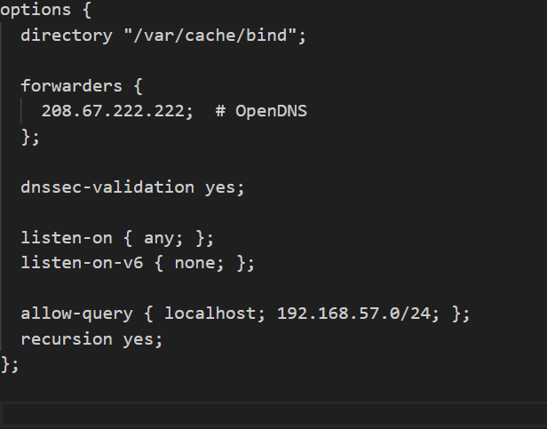

# Carlos Rodríguez Ruiz

# Proyecto DNS Maestro-Esclavo

Este proyecto consiste en la configuración de un sistema DNS maestro-esclavo utilizando máquinas virtuales. A continuación, se describen los principales archivos de configuración, los objetivos y las verificaciones necesarias para completar la práctica.

## Requisitos del Proyecto

- **Servidor DNS Maestro y Esclavo**: Configuración de un servidor DNS maestro y otro esclavo con zonas directa e inversa.
- **Red**: Todas las máquinas están en la red 192.168.57.0/24.
- **Equipos**:
  - **Maestro**: tierra.sistema.test(IP: .103)
  - **Esclavo**: venus.sistema.test (IP: .102)
  - **Otros equipos**:
    - mercurio.sistema.test (IP: .101)
    - marte.sistema.test (IP: .104)

## Configuración del DNS

Los archivos clave para configurar el sistema DNS se encuentran en el servidor maestro (tierra.sistema.test) y el esclavo (venus.sistema.test). A continuación se explican los archivos principales de configuración:

### Archivo: Zona directa /etc/bind/db.sistema.test

Este archivo define los registros DNS de la zona directa de sistema.test, incluyendo los registros de tipo **A** (asociación de nombres con direcciones IP) y los servidores DNS primarios y secundarios.

- **SOA**: Define la autoridad principal de la zona, que es ns1.sistema.test.
- **NS**: Establece los servidores de nombres (ns1 y ns2).
- **A**: Registros que asignan las direcciones IP correspondientes a ns1 y ns2.

### Archivo: Zona inversa /etc/bind/db.192

Este archivo define los registros para la zona inversa, que permiten resolver las direcciones IP a nombres de dominio (PTR).

- **PTR**: Registros para la resolución inversa, que asocian las IPs con los nombres de dominio.

### Archivo: /etc/bind/named.conf.local

Este archivo configura la zona para el servidor DNS maestro, incluyendo las zonas directa e inversa, y habilita la transferencia de zona al servidor esclavo (venus.sistema.test).

- **allow-transfer**: Permite que el servidor esclavo (192.168.57.102) reciba la transferencia de zona.

### Archivo: /etc/bind/named.conf.options

Este archivo contiene configuraciones generales del servidor DNS, como las redes que pueden hacer consultas recursivas y el reenviador de consultas a OpenDNS.

- **forwarders**: Reenvía consultas no resueltas a OpenDNS.
- **dnssec-validation**: Habilita la validación DNSSEC.
- **allow-query**: Permite consultas desde la red local.

## Configuración de las Máquinas Virtuales

La infraestructura de las máquinas virtuales se gestiona mediante un archivo Vagrantfile. A continuación se muestra cómo se configuran las máquinas tierra (maestro) y venus (esclavo) para este proyecto.

### Archivo: Vagrantfile

- **Máquina Venus**: Esclavo DNS, dirección IP 192.168.57.102, configuración automática de BIND.
- **Máquina Tierra**: Maestro DNS, dirección IP 192.168.57.103, configuración automática de BIND.

## Verificación del Sistema

Una vez configurado el sistema, debes comprobar los siguientes puntos:

- Resolución correcta de registros tipo A.

- Resolución inversa de direcciones IP.

- Resolución de los alias ns1.sistema.test y ns2.sistema.test.

- Consulta de servidores NS de sistema.test, que debe devolver los servidores tierra.sistema.test y venus.sistema.test.

- Consulta de servidores MX de sistema.test.

- Verificación de la transferencia de zona entre el servidor maestro y el esclavo (consulta AXFR).

- Comprobación de que tanto el maestro como el esclavo responden correctamente a las mismas consultas.

